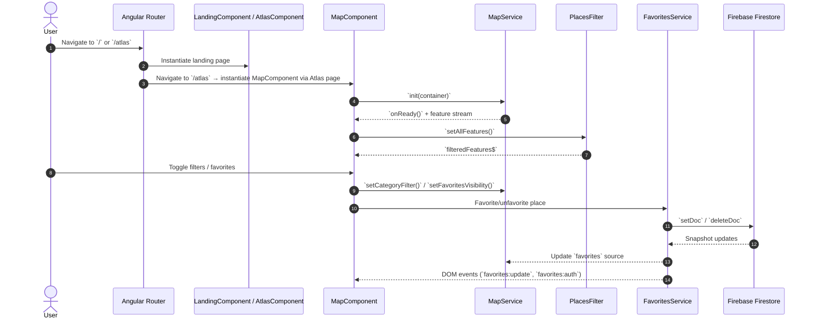
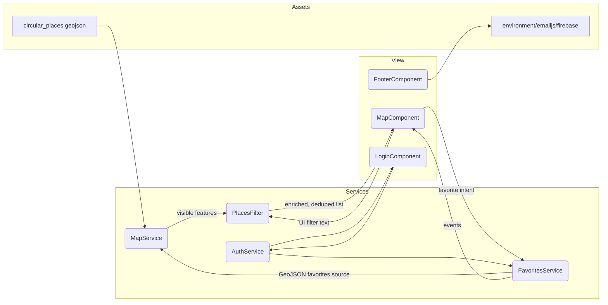
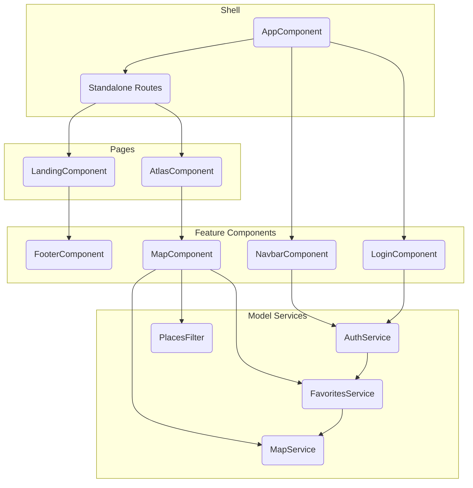
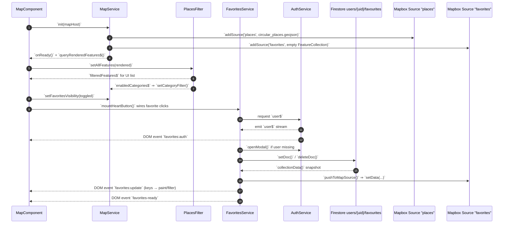
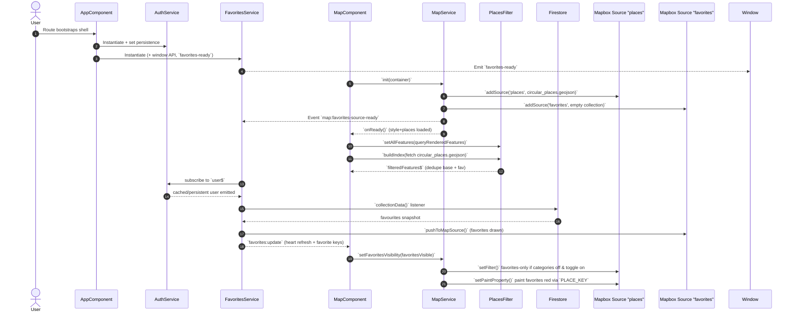

# Circeco System Diagrams

Visuals below capture the same architecture described in `ARCHITECTURE.md`, but translate it into Mermaid diagrams for quick onboarding, debugging, and data-trace exercises.

## Flow Control (routing → persistence)

## Data Lineage (places list & favorites)

## Component Structure (high-level topology)

## Favorites + Filtering (service handshake)

## Favorites Chronology (page load)

