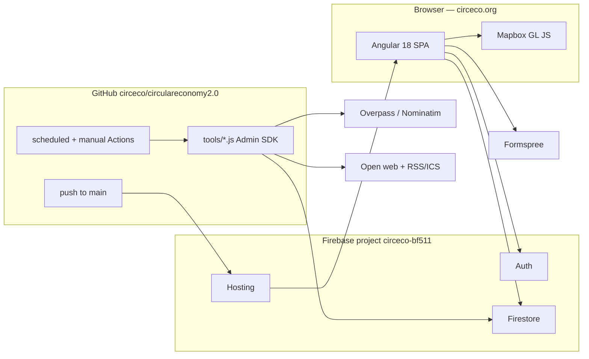
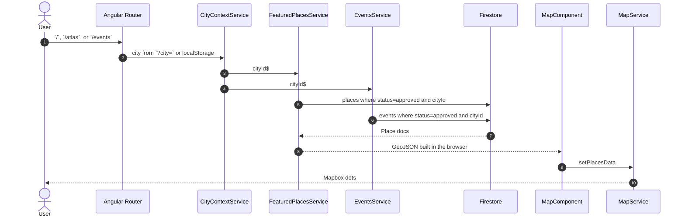
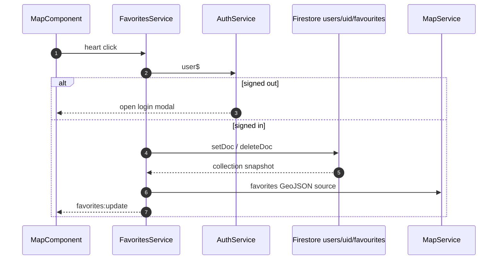
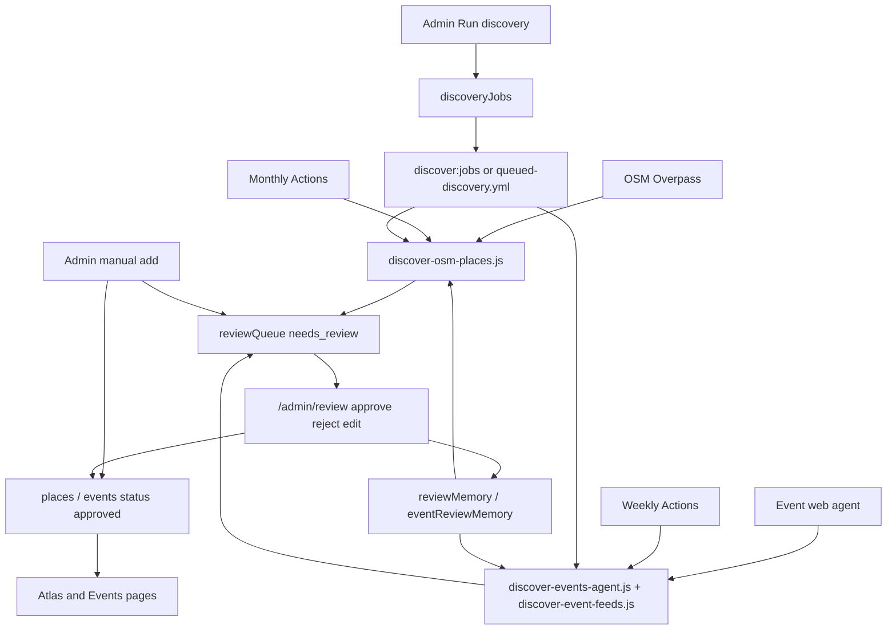
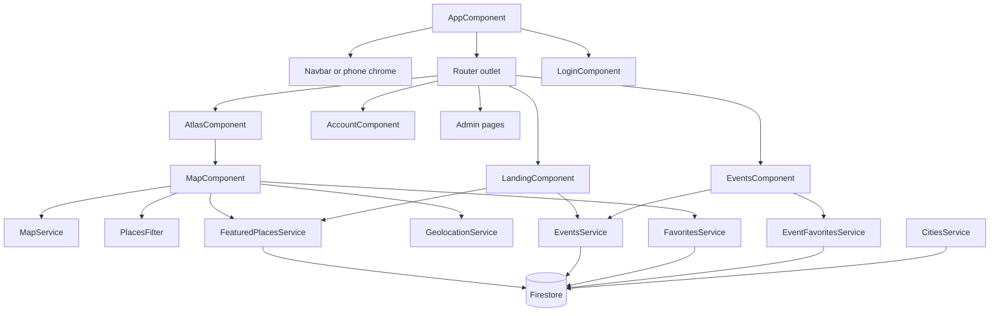

# Circeco diagrams

Same system as [`ARCHITECTURE.md`](ARCHITECTURE.md).

## System topology

```mermaid
flowchart LR
  subgraph Browser["Browser — circeco.org"]
    SPA["Angular 18 SPA"]
    Mapbox["Mapbox GL JS"]
  end

  subgraph Firebase["Firebase project circeco-bf511"]
    Auth["Auth"]
    FS["Firestore"]
    Host["Hosting"]
  end

  subgraph GitHub["GitHub circeco/circulareconomy2.0"]
    Push["push to main"]
    Cron["scheduled + manual Actions"]
    Tools["tools/*.js Admin SDK"]
  end

  OSM["Overpass / Nominatim"]
  Web["Open web + RSS/ICS"]
  Formspree["Formspree"]

  SPA --> Auth
  SPA --> FS
  SPA --> Mapbox
  SPA --> Formspree
  Host --> SPA
  Push --> Host
  Cron --> Tools
  Tools --> FS
  Tools --> OSM
  Tools --> Web
```

## Public read path

```mermaid
sequenceDiagram
  autonumber
  actor User
  participant Router as Angular Router
  participant City as CityContextService
  participant Places as FeaturedPlacesService
  participant Events as EventsService
  participant FS as Firestore
  participant MapCmp as MapComponent
  participant MapSvc as MapService

  User->>Router: `/`, `/atlas`, or `/events`
  Router->>City: city from `?city=` or localStorage
  City->>Places: cityId$
  City->>Events: cityId$
  Places->>FS: places where status=approved and cityId
  Events->>FS: events where status=approved and cityId
  FS-->>Places: Place docs
  Places-->>MapCmp: GeoJSON built in the browser
  MapCmp->>MapSvc: setPlacesData
  MapSvc-->>User: Mapbox dots
```

## Favourites

```mermaid
sequenceDiagram
  autonumber
  participant MapCmp as MapComponent
  participant Fav as FavoritesService
  participant Auth as AuthService
  participant FS as Firestore users/uid/favourites
  participant MapSvc as MapService

  MapCmp->>Fav: heart click
  Fav->>Auth: user$
  alt signed out
    Auth-->>MapCmp: open login modal
  else signed in
    Fav->>FS: setDoc / deleteDoc
    FS-->>Fav: collection snapshot
    Fav->>MapSvc: favorites GeoJSON source
    Fav-->>MapCmp: favorites:update
  end
```

## Discovery and moderation

```mermaid
flowchart TD
  OSM["OSM Overpass"] --> PlaceScript["discover-osm-places.js"]
  Agent["Event web agent"] --> EventScripts["discover-events-agent.js + discover-event-feeds.js"]
  AdminRun["Admin Run discovery"] --> Jobs["discoveryJobs"]
  Jobs --> Worker["discover:jobs or queued-discovery.yml"]
  CronM["Monthly Actions"] --> PlaceScript
  CronW["Weekly Actions"] --> EventScripts
  Worker --> PlaceScript
  Worker --> EventScripts
  PlaceScript --> Queue["reviewQueue needs_review"]
  EventScripts --> Queue
  Manual["Admin manual add"] --> Queue
  Manual --> Catalog
  Queue --> Review["/admin/review approve reject edit"]
  Review --> Catalog["places / events status approved"]
  Review --> Memory["reviewMemory / eventReviewMemory"]
  Memory --> PlaceScript
  Memory --> EventScripts
  Catalog --> Public["Atlas and Events pages"]
```

## Pages and services

```mermaid
flowchart TD
  App["AppComponent"] --> Nav["Navbar or phone chrome"]
  App --> Outlet["Router outlet"]
  App --> Login["LoginComponent"]

  Outlet --> Landing["LandingComponent"]
  Outlet --> Atlas["AtlasComponent"]
  Outlet --> EventsPage["EventsComponent"]
  Outlet --> Account["AccountComponent"]
  Outlet --> Admin["Admin pages"]

  Atlas --> MapCmp["MapComponent"]
  MapCmp --> MapSvc["MapService"]
  MapCmp --> Filter["PlacesFilter"]
  MapCmp --> Featured["FeaturedPlacesService"]
  MapCmp --> Geo["GeolocationService"]
  MapCmp --> Fav["FavoritesService"]

  Landing --> Featured
  Landing --> EventsSvc["EventsService"]
  EventsPage --> EventsSvc
  EventsPage --> EventFav["EventFavoritesService"]

  Featured --> FS[(Firestore)]
  EventsSvc --> FS
  Fav --> FS
  EventFav --> FS
  Cities["CitiesService"] --> FS
```
