# Scheduled Discovery Job: Plan and Self-Improvement Loop

## Purpose

This document defines how the scheduled place discovery system works, how it feeds the moderation queue, and how it improves over time from human review decisions.

The goal is to:
- discover new circular places regularly (monthly),
- minimize duplicate/low-quality candidates,
- learn from admin approvals/rejections,
- keep costs and operations efficient while scaling to many cities.

---

## Scope

This plan applies to:
- place discovery ingestion jobs (initially OSM-based),
- review queue candidate generation,
- review feedback memory and scoring,
- periodic policy/rule refinement.

Out of scope (initially):
- automatic publishing without human review,
- heavy ML model training infrastructure,
- aggressive paid-source expansion before baseline quality is stable.

---

## High-Level Workflow

```mermaid
flowchart LR
  scheduler[MonthlyScheduler] --> cityRun[RunPerCityDiscovery]
  cityRun --> sourceFetch[FetchSourceData]
  sourceFetch --> normalize[NormalizeAndFeatureBuild]
  normalize --> dedupe[CityScopedDedupeChecks]
  dedupe --> score[ConfidenceAndPolicyScoring]
  score --> queueWrite[WriteNeedsReviewQueue]
  queueWrite --> adminReview[HumanAdminReview]

  adminReview --> approve[Approved]
  adminReview --> reject[Rejected]
  approve --> memoryUpdate[UpdateReviewMemory]
  reject --> memoryUpdate
  memoryUpdate --> monthlyLearning[MonthlyLearningReportAndPolicyUpdate]
  monthlyLearning --> nextRun[NextScheduledRun]
```

---

## Monthly Scheduled Discovery: How It Works

### Implementation status (current)
- Scheduler workflow is implemented at `.github/workflows/monthly-discovery-learning.yml`.
- Automatic schedule is monthly (`0 3 1 * *`, UTC) with manual `workflow_dispatch`.
- Discovery runner: `npm run discover:monthly` (`tools/scheduled-discovery-job.js`).
- Learning runner: `npm run learning:report` (`tools/generate-learning-v1-report.js`).
- Run telemetry writes to `discoveryRuns`; learning outputs write to `learningStats`.
- City aliases include `torino -> turin` and `milano -> milan`.
- Overpass resilience includes retries/mirror rotation plus adaptive radius fallback.

### 1) Trigger
A scheduler runs monthly (for example: first day of month, off-peak hours).

### 2) Per-city execution
Discovery runs city-by-city to limit load and isolate failures.

### 3) Source fetch and candidate extraction
Initial source: OpenStreetMap/Overpass.
Future sources can be added incrementally.

### 4) Normalization and feature generation
Each candidate is normalized into compact comparison features:
- normalized name and address,
- city-scoped place key,
- coarse geo bucket,
- inferred tags/categories/action labels,
- source evidence metadata.

### 5) Dedupe and skip gates
Before queue insertion:
- skip already-final reviewed queue items,
- skip matches against approved catalogue entries,
- apply review memory matching (hard/soft rules),
- apply confidence penalties for weak matches.

### 6) Queue write
Remaining candidates are written to `reviewQueue` with `status = needs_review`.

### 7) Human moderation
Admins approve/reject/edit candidates.

---

## Learning and Improvement Loop

### Core principle
Learning starts with rules + memory + metrics, not black-box auto-publish.

### Feedback labels
From admin review:
- approved -> positive signal,
- rejected -> negative signal,
- optional structured reject reason -> high-value learning signal.

### What gets learned
- which source/tag patterns are high precision,
- which patterns create false positives,
- which chains/keywords need stricter handling,
- where confidence thresholds should move.

### Monthly policy update
After each monthly cycle:
- aggregate approval/rejection rates by rule/source/tag/city,
- identify top false-positive patterns,
- tune discovery policy:
  - hard-skip known low-value patterns,
  - soft-penalize borderline patterns,
  - boost high-quality signals.

### Safety rule
Learning influences ranking/filtering only.
Human review remains final approval gate in initial phases.

---

## Data Model Expectations (Conceptual)

### Discovery run logs (recommended)
Create a `discoveryRuns` log per execution:
- `runId`, `cityId`, `startedAt`, `finishedAt`, `status`,
- `fetchedCount`, `queuedCount`,
- `skippedReviewedQueue`, `skippedApproved`, `skippedMemory`,
- `errors[]`, `elapsedMs`.

### Review memory (compact)
Store compact fields only:
- fingerprint/key fields,
- approved/rejected counters,
- last decision and timestamp,
- optional rejection signals/reasons.

Avoid storing large duplicated payload blobs.

---

## Quality and Performance Strategy

### Precision-first at scale
- Keep city-scoped dedupe lookups.
- Avoid global scans.
- Use compact indexes/rollups where needed.

### Reliability
- retries and backoff for external source failures,
- bounded per-city write caps,
- fail city-run independently (do not block all cities).

### Cost efficiency
- start with OSM + rule/memory learning,
- add paid sources only when metrics justify incremental value.

---

## KPI Dashboard (Minimum)

Track monthly per city:
- queue inflow (`queuedCount`),
- approval rate,
- rejection rate,
- duplicate skip rates (by skip type),
- median review turnaround time,
- top rejection reasons/patterns.

Target trend:
- stable queue volume,
- rising approval precision,
- falling avoidable duplicates.

---

## Phased Implementation Plan

### Phase 1 - Scheduled baseline
- Monthly city-by-city scheduling.
- Deterministic queue generation.
- Run logs and basic monitoring.

### Phase 2 - Learning v1
- Structured reject reasons in admin workflow.
- Monthly rule-quality report.
- Confidence/policy tuning rules.

### Phase 3 - Multi-source expansion
- Add one additional source at a time.
- Per-source reliability scoring.
- Maintain same moderation gate.

### Phase 4 - Optional ML enhancement
- Use historical labels for improved scoring.
- Keep conservative deployment with human-in-loop safeguards.

---

## Operational Playbook

### Failure handling
- Retry transient source failures.
- Mark run status failed with error summary.
- Continue with other cities when safe.

### Manual controls
- On-demand rerun per city.
- Temporary city pause/disable.
- Threshold/cap overrides for emergency moderation load.

---

## Risks and Mitigations

- Over-filtering (missing good places): keep soft penalties before hard skips.
- Under-filtering (queue noise): tighten low-quality patterns via monthly reports.
- Rule drift across cities: track metrics per city before global policy changes.
- External API instability: multi-endpoint retries + per-city isolation.

---

## Definition of Success

This system is successful when:
- monthly discovery is reliable and mostly hands-off,
- queue quality improves month-over-month,
- duplicate and obvious false positives decrease,
- reviewer effort shifts from cleanup to meaningful approvals,
- operational cost stays low relative to coverage growth.

