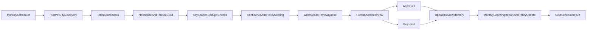

# Scheduled Discovery Job: Plan and Self-Improvement Loop

**Roadmap / ops plan** — cadence, phases, KPIs, and goals.  
**Live behaviour** (memory collections, hard/soft gates, how to run scripts): [`DISCOVERY_SCRIPTS.md`](DISCOVERY_SCRIPTS.md) → *Learning strategy*.  
**Target contracts / auto-policy guardrails**: [`LEARNING_V1_SPEC.md`](LEARNING_V1_SPEC.md).

## Purpose

How scheduled discovery feeds the moderation queue and improves over time from human review — without auto-publishing or heavy ML.

Goals:
- discover circular places monthly and events weekly,
- minimize duplicate/low-quality candidates,
- learn from admin approvals/rejections,
- stay cost-efficient as cities scale.

---

## Scope

Applies to place/event ingestion, `reviewQueue`, review-memory scoring, and periodic policy refinement.

Out of scope (initially): auto-publish, ML training platforms, aggressive paid sources before quality is stable.

---

## High-Level Workflow

```mermaid
flowchart LR
  scheduler[MonthlyScheduler] --> cityRun[RunPerCityDiscovery]
  cityRun --> sourceFetch[FetchSourceData]
  sourceFetch --> normalize[NormalizeAndFeatureBuild]
  normalize --> dedupe[CityScopedDedupeChecks]
  dedupe --> score[ConfidenceAndPolicyScoring]
  score --> queueWrite[WriteNeedsReviewQueue]
  queueWrite --> adminReview[HumanAdminReview]

  adminReview --> approve[Approved]
  adminReview --> reject[Rejected]
  approve --> memoryUpdate[UpdateReviewMemory]
  reject --> memoryUpdate
  memoryUpdate --> monthlyLearning[MonthlyLearningReportAndPolicyUpdate]
  monthlyLearning --> nextRun[NextScheduledRun]
```

---

## Scheduled discovery: how it works

### Implementation status (current)

Details and commands live in [`DISCOVERY_SCRIPTS.md`](DISCOVERY_SCRIPTS.md). Summary:

- Monthly places + learning: `.github/workflows/monthly-discovery-learning.yml` (`0 3 1 * *` UTC)
- Weekly events: `.github/workflows/weekly-events-discovery.yml` (`0 3 * * 1` UTC)
- Runners: `discover:monthly`, `discover:events:agent` (primary events), `discover:events` (feeds), `learning:report`
- Telemetry: `discoveryRuns`; monthly aggregates: `learningStats`
- City aliases: `torino → turin`, `milano → milan`
- Overpass: retries, mirrors, adaptive radius fallback

### Pipeline steps (per city)

1. **Trigger** — monthly places (+ learning report); weekly events (upcoming-only by default).
2. **Fetch** — places: OSM/Overpass; events: web agent (+ optional feeds).
3. **Normalize** — compact features (name/address, keys, geo bucket, tags, evidence).
4. **Dedupe / memory gates** — see *Learning strategy* in [`DISCOVERY_SCRIPTS.md`](DISCOVERY_SCRIPTS.md).
5. **Queue** — remaining candidates → `reviewQueue` (`needs_review`).
6. **Moderate** — admin approve / reject / edit (human gate).

---

## Learning principles (plan-level)

- **Rules + memory + metrics**, not black-box auto-publish.
- Online memory biases the **next** discovery run; monthly report informs **manual** rule changes.
- Learning may rank/filter only; humans remain the publish gate until precision is proven.
- Structured reject reasons and guarded auto-policy are **planned** — see [`LEARNING_V1_SPEC.md`](LEARNING_V1_SPEC.md). Do not duplicate collection schemas here.

---

## Quality and performance

- City-scoped lookups; compact indexes/rollups; no global scans.
- Retries/backoff for sources; fail cities independently; bounded write caps.
- OSM + memory first; add paid sources only when metrics justify cost.

---

## KPI dashboard (minimum)

Track monthly per city:

- queue inflow (`queuedCount`),
- approval / rejection rates,
- duplicate skip rates (by type),
- median review turnaround,
- top rejection patterns (when reasons exist).

Target trend: stable queue volume, rising precision, fewer avoidable duplicates.

---

## Phased plan

### Phase 1 — Scheduled baseline ✅ in use
Monthly/weekly jobs, deterministic queue writes, run logs.

### Phase 2 — Learning v1 (partial)
Online place + event memory ✅; monthly `learningStats` ✅; structured reject reasons and auto policy apply ❌ (spec only).

### Phase 3 — Multi-source expansion
Add sources one at a time; per-source reliability; same moderation gate.

### Phase 4 — Optional ML
Shadow re-ranker vs rule baseline; human gate until reliability is proven.

---

## Operational playbook

- Retry transient source failures; mark run failed with summary; continue other cities when safe.
- Manual: per-city rerun, temporary pause, threshold/cap overrides under review load.

---

## Risks

- Over-filtering → prefer soft penalties before hard skips.
- Under-filtering → tighten via monthly stats + rule PRs.
- City drift → per-city metrics before global policy changes.
- API instability → mirrors/retries + per-city isolation.

---

## Definition of success

Stable scheduled runs, falling avoidable duplicate reviews, rising approval precision over 2–3 monthly cycles, and a queue volume humans can keep up with — without auto-publish.
